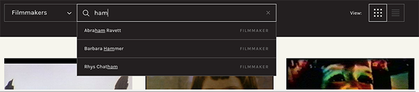

# React Typeahead

### Code Summary

These two files are part of the typeahead search functionality on [canyoncinema50.org].

- `typeahead-choices-actions.js`: this is an action file that communicates with a Redux store, dispatching data returned from API calls. It contains queries called from `TypeAheadChoices.jsx` so I included it for context. It shows use of ES6 Promises, anonymous arrow functions, error catching, and an understanding of basic Redux concepts.

- `TypeAheadChoices.jsx`: this React component is part of a larger architecture making up a search bar. It detects typed input, sends that input off in a request for matching items, and displays the returned matches as you type. There are a couple neat features:
    - Debounced typing detection to prevent too many requests during user input
    - Underlining matched text in resulting titles

    

### Background

This is work from 2018, part of a larger project that communicated with the CollectionSpace API to display the Canyon Cinema Foundation's catalog. All code is open source.

*Please note: These files have been removed from their original directory structures for presentation purposes.*